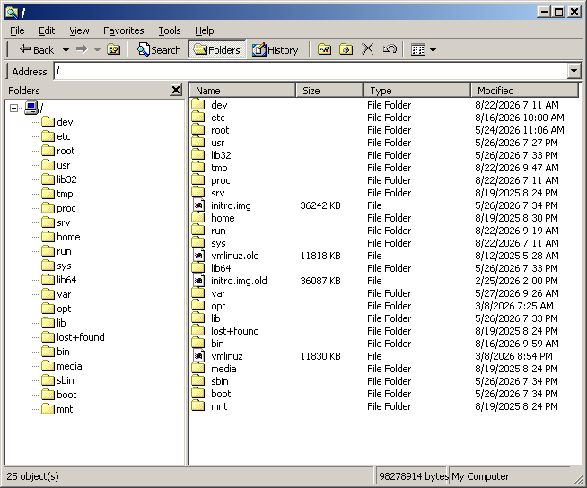

# ween32

**The classic win32 API, reimplemented small and portable.**

ween32 aims to let you write plain old win32 code — `RegisterClassA`,
`CreateWindowExA`, a `WndProc`, `BeginPaint`, `"BUTTON"` child windows sending
`WM_COMMAND` — and run it outside Windows, with the classic Windows 2000 look
reproduced pixel for pixel. The same program compiles unchanged against real
`windows.h` on Windows, where `<ween32.h>` simply defers to it.

A file browser, laid out from a screenshot of the real one — a rebar, a tree
and a list either side of a splitter, and a status bar in three parts:

And Paint, in Zig, measured against a Windows 2000 running the real thing —
six pixels of 110,000 apart, and pixel for pixel in the tool box, the colour
box, the menu bar and the view:

**This is a work in progress.** See [ROADMAP.md](ROADMAP.md) for what works
today and what does not, [docs/design.md](docs/design.md) for how it is
built, [docs/paint.md](docs/paint.md) for how Paint was measured, and
[docs/testing.md](docs/testing.md) for how to check it.

The library code is MIT. The embedded fonts are Wine's redistributable Tahoma,
MS Sans Serif and Marlett replacements and carry their own (LGPL) license.
MS Sans Serif is there because that is what "MS Shell Dlg" resolves to on this
Windows, and so what every dialog is lettered in — its capitals are a row
taller than Tahoma's, which is why a dialog does not look like the rest of the
shell.
