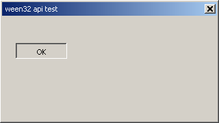

# ween32

**The classic win32 API, reimplemented small and portable.**

ween32 is a C99 library that lets you write plain old win32 code — `RegisterClassA`,
`CreateWindowExA`, a `WndProc`, `GetMessageA`/`DispatchMessageA`, `BeginPaint`, `FillRect`,
`DrawEdge`, `"BUTTON"` child windows sending `WM_COMMAND` — and run it outside Windows,
with the classic Windows 2000 look reproduced pixel for pixel.

```c
#include <ween32.h>   /* on Windows this defers to <windows.h>: same code, both worlds */
```

The same program compiles **unchanged** against real `windows.h` on Windows and against
ween32 everywhere else. That dual-compile property is the project's fidelity contract.



The flagship example is the classic Windows calculator, recreated in `examples/calc.c` as
pure win32 code — built the authentic way from a **dialog template**: the controls are
declared once in dialog units and the dialog manager (`CreateDialogIndirectParam`)
instantiates them and maps their DLUs to pixels. Owner-drawn colored keys
(`BS_OWNERDRAW`/`WM_DRAWITEM`), memory keys, `Enter`=equals via `IsDialogMessage`, and all:


## Why it looks right

- **Software rendering, no 2D library.** Every pixel is drawn by ween32 into a plain
  `uint32_t` buffer. The classic look is crisp aliased 1px lines and exact palette colors —
  antialiasing vector libraries fight that; a ~500-line rasterizer nails it.
- **The authentic algorithms.** The 3D bevel is Wine's `DrawEdge`; the system colors are the
  Win2000 `GetSysColor` defaults; the caption is the real navy→blue gradient.
- **The authentic text.** Small GDI text was never rasterized from outlines: it came from
  hand-tuned 1-bit bitmaps embedded in the font. ween32 reads Tahoma's 11-ppem embedded
  strikes (EBLC/EBDT) directly — the same glyphs GDI showed. Caption glyphs (the close box ✕)
  come from Marlett's outlines, scanline-filled with no antialiasing, as `DrawFrameControl`
  drew them.
- **The authentic layout.** Dialogs position controls in **dialog units** via
  `GetDialogBaseUnits`/`MapDialogRect` (`px = MulDiv(dlu, base, 4 or 8)`), so the standard
  50×14 DLU button comes out 75×23 px — nothing is hand-placed.

## Architecture

```
 your win32-style C code
 ────────────────────────────────────────────────
 win32 API layer      user.c  gdi.c  dialog.c
 software engine      surface.c classic.c font.c marlett.c   (zero deps)
 presentation         x11.c (XPutImage blit + input)  headless.c (tests)
```

A top-level window owns one native (X11) window and one surface; the library draws the
non-client chrome (caption, close box, drag) in `DefWindowProcA`, controls are child windows
hit-tested down the tree — USER32's shape, scoped down. The backends only blit the finished
buffer and report input; they never draw. On Windows there is no backend: your code just uses
the real thing.

## Build

```sh
make            # libween32.a + examples (dialog, calc; libX11 to run them live)
make test       # headless test suite: engine pixels + full API path, no display needed
make X11=0      # library without the X11 backend
```

Any example also runs without a display: `WEEN32_HEADLESS=1 WEEN32_BMP=shot.bmp
WEEN32_SCRIPT="d:113,169 u:113,169" ./examples/calc` renders to a BMP, driven by scripted
input — that is how the screenshots above were made and how CI can exercise real apps.

The dual-compile gate (needs zig or a mingw toolchain):

```sh
zig cc -target x86_64-windows-gnu -std=c99 -Iinclude examples/dialog.c -luser32 -lgdi32
```

## Scope (v1)

Windowing: `RegisterClassA, CreateWindowExA, DestroyWindow, ShowWindow, MoveWindow,
GetClientRect, SetWindowTextA/GetWindowTextA, GetDlgItem, SetFocus, InvalidateRect,
UpdateWindow`, the message loop (`GetMessageA/TranslateMessage/DispatchMessageA,
SendMessageA, PostQuitMessage, DefWindowProcA`), `WM_CREATE/PAINT/COMMAND/CLOSE/DESTROY/
KEYDOWN/LBUTTON*/MOUSEMOVE/NCHITTEST/NCPAINT`, built-in `BUTTON` (`BS_PUSHBUTTON`,
`BS_DEFPUSHBUTTON`) and `STATIC` classes.

GDI: `BeginPaint/EndPaint, FillRect, DrawEdge, DrawFrameControl (DFC_CAPTION), TextOutA,
DrawTextA, GetTextExtentPoint32A, SetTextColor, SetBkMode, GetSysColor(Brush),
CreateSolidBrush, DeleteObject, GetStockObject(DEFAULT_GUI_FONT), SelectObject`.

Dialogs (the authentic layout path): `CreateDialogIndirectParamA` (+ `CreateDialogIndirectA`)
builds a dialog from a `DLGTEMPLATE`/`DLGITEMTEMPLATE`, instantiating each control and mapping
its dialog units to pixels; `DLGPROC` (`WM_INITDIALOG`), `DefDlgProcA`, `EndDialog`,
`IsDialogMessageA` (Tab / Enter→default / Esc), `DM_SETDEFID`, `GetDlgCtrlID`,
`GetDialogBaseUnits`, `MapDialogRect`, `MulDiv`. An app declares a control table in DLUs — no
pixel arithmetic — exactly like a `.rc` `DIALOGEX` resource.

Not yet: EDIT/LISTBOX, menus, modal `DialogBox` (needs multiple top-level windows), wide-char
(`W`) APIs, pens/regions, resizable windows, timers. The subset grows by need, always with
SDK-exact names, values and semantics (constants are verified against mingw-w64's headers).

## Fonts and licensing

The library code is MIT. The embedded fonts (`fonts/tahoma.ttf`, `fonts/marlett.ttf`) are
Wine's redistributable Tahoma and Marlett replacements (see Wine's `fonts/` — LGPL); they
carry their own license, not MIT. They are build-time embedded byte arrays; swap the files
and regenerate (`xxd -i`) to use different metrics-compatible fonts.
