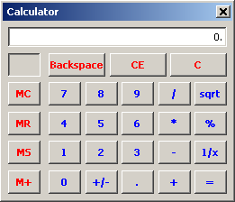

# ween32

**The classic win32 API, reimplemented small and portable.**

ween32 aims to let you write plain old win32 code — `RegisterClassA`,
`CreateWindowExA`, a `WndProc`, `BeginPaint`, `"BUTTON"` child windows sending
`WM_COMMAND` — and run it outside Windows, with the classic Windows 2000 look
reproduced pixel for pixel. The same program compiles unchanged against real
`windows.h` on Windows, where `<ween32.h>` simply defers to it.

**This is a work in progress.** See [ROADMAP.md](ROADMAP.md) for what works
today and what does not, and [docs/design.md](docs/design.md) for how it is
built.

The library code is MIT. The embedded fonts are Wine's redistributable Tahoma
and Marlett replacements and carry their own (LGPL) license.
