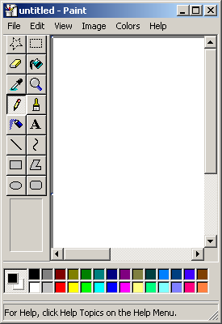

# Paint

`examples/mspaint` is Windows 2000's Paint, written to win32 and running on
ween32. It is in Zig — through the `ween32` module the package already
exposed — and the same source compiles for Windows, where the module's
declarations are the real USER32, GDI32, COMCTL32 and COMDLG32.



The window is the machine's, not an impression of it. Held up against a
Windows 2000 running the real program, it differs by **six pixels of
110,000**: three where ween32 synthesises the caption's bold title, and three
where Paint's MFC status bar draws two empty panes as zero-height boxes
beside the size grip. The tool box, the settings box under it, the colour
box, the menu bar and the view are pixel for pixel, in every one of the
sixteen tool states — and so is what the tools draw, which is checked by
drawing the same thing on both and counting (see [Checking it](#checking-it)).

## Where the numbers came from

Nothing about the layout is invented, and nothing was eyeballed off a
screenshot where the machine could be asked instead.

**The windows.** `tools/vm/probe.c` runs inside the machine, walks Paint's
own window tree and prints every rectangle, style and control id:

```
MSPaintApp            0,0   275x400   client 267x354
  AfxControlBar42u    4,42   57x282   "Tools"
  AfxFrameOrView42u  61,42  210x282   the view, with a client edge
  AfxControlBar42u    4,324 267x49    "Colors"
  msctls_statusbar32  4,373 267x23
  ToolChild           8,42   25x25    ...sixteen of them
```

The tool box is 57 wide because Paint's is 57 wide. The status bar is 23
because MFC makes Paint's 23 — taller than the font implies, which is why it
is created with `CCS_NORESIZE` and placed by the application.

The probe is built with no C runtime at all (`zig cc -nostdlib`): mingw's
imports the `api-ms-win-crt-*` stubs, which Windows 2000 has never heard of,
and its PE header has to say NT 4.0 or the machine calls it "not a valid
Win32 application" (`tools/vm/pe2k.py`).

**The menu** is the menu the probe read out of it, item ids, accelerator
text and greyed states included, and the line each item puts in the status
bar is the machine's own — checked against it by hovering and reading the
bar back.

Colors > Edit Colors is the *system's* box rather than Paint's, and it is
measured the same way: `tools/refcapture/paint/dlg-colors.png` shut and
`dlg-colors-open.png` open. Its hue-and-saturation field is drawn in sixty
blocks by thirty, which is what the machine draws, and matches it exactly.

**The dialogs.** The probe dumps a dialog's controls the same way, and
`tools/mspaint/dlu.py` runs the dialog manager backwards over that dump:

```sh
tools/vm/drive.py key KeyR:OSLeft ... 'Z:\probe.exe "Custom Zoom" Z:\zoom.txt'
tools/mspaint/dlu.py ~/paintshare/zoom.txt
```

```
dialog 300x135 px = 200 x 83 du   style=94C820C4
  Static   id=1065   .x = 13, .y = 7, .cx = 47, .cy = 7,  ...  'Current zoom:'
  Button   id=1082   .x = 13, .y = 38, .cx = 33, .cy = 10, ...  '&100%'
```

Every control of every box Paint opens lands on a whole number of units,
which is what says these are the resource's own numbers and not a fit to
them. `examples/mspaint/dialogs.zig` writes those units and the dialog
manager puts them back on the same pixels. The four little pictures in
Stretch and Skew, and the icon in About, are cut out of the machine's own
dialogs the way the tool glyphs are.

**The pictures.** The sixteen tool glyphs and the icon in the caption are cut
out of screenshots of the machine and generated into Zig by
`tools/mspaint/genart.py`. The settings box is generated too, by
`tools/mspaint/genoptions.py`, from one screenshot per setting: the pixels
that change when a setting is chosen are that setting's rectangle — which is
also where a click on it lands — and that rectangle out of its own
screenshot and out of any other are the two pictures to draw. Nothing is
interpreted, so a colour picture and a one-bit glyph need no distinction.

**The pointers.** Each tool has a drawing of its own — a pencil, a bucket, a
magnifier — and a cursor is not in the window, so the probe cannot ask for it
and a screenshot of the window does not hold it. The emulator draws the
pointer into its frame buffer, though, so a screenshot of the *screen* does:
`tools/mspaint/grabcursors.py` picks each tool in turn and parks the pointer
over a page flooded with the palette's grey, which tells the four kinds of
pixel apart in one shot — grey is the page showing through, black and white
are the cursor's own, and the inverse of grey is a pixel that inverts what is
under it, which is how the brush's dotted cross is drawn. The hot spot is
measured first, by leaving a pencil dot at the same place: the ink lands on
it.

The rubber's is the one exception. Its cursor is the size it rubs out, so it
is drawn rather than read: a square outline with the pointer in the middle,
which is what the captured one is at its smallest.

**The tools.** The twelve brushes are twelve shapes, not sizes of a formula:
a click with each on the machine, read back off the screen. The disc a wide
pen puts down is the machine's too — two across is a full square, three a
plus, four and five squares with the corners off.

## Checking it

```sh
zig build mspaint
WEEN32_HEADLESS=1 WEEN32_DPI=96 WEEN32_BMP=/tmp/paint.bmp ./zig-out/bin/mspaint
```

`tools/refcapture/paintdiff.py` compares that render with the machine's,
totalled by region — the tool box, the view, the colour box — so a total is
attributable rather than a percentage of a window:

```sh
tools/refcapture/paintdiff.py               # totals, by region
tools/refcapture/paintdiff.py 4 42 57 40    # one region, as an ASCII map
```

It wants `tools/refcapture/paint/00-default.png`, a screenshot of the
machine's Paint window taken with `tools/vm/drive.py`. Those captures are
gitignored: they are pictures of someone else's program, and they can be
taken again.

`tools/mspaint/compare.py` draws the *same thing* on both and counts the
difference:

```sh
tools/mspaint/compare.py "tool 12" "drag 76,57 126,87"     # a rectangle
tools/mspaint/compare.py "tool 7" "option 5" "click 120,100"  # one brush
```

It calibrates first. The guest's mouse is relative, and asking for (120,160)
can leave the pointer at (120,159) — consistently, and for reasons of its
own. That one pixel is not a difference in what Paint draws, but it moves
every pixel of a shape, so the numbers are calibrated by leaving a pencil dot
at each point of the gesture and reading back where they landed; our copy is
then driven with *those* coordinates.

What matches exactly: a pen dot at every width, horizontal and vertical lines
at every width, one-pixel lines at any angle, all twelve brushes, the four
rubber sizes, the flood fill, and a rectangle.

And the selection, which is most of what Paint is:

```sh
# a rectangle, the page flooded round it, the rectangle selected
# transparently and dragged onto the flood
tools/mspaint/compare.py "tool 10" "option 0" "tool 12" "drag 76,57 126,87" \
    "color 17" "tool 3" "click 200,200" \
    "tool 1" "option 1" "drag 70,50 132,92" "drag 100,70 160,150"
canvas: 0 differing pixels of 48433
```

Zero with the setting off as well, zero for a free-form selection round a
square path, and zero for the colour eraser — the rubber held with the right
button, which changes the pixels that are the foreground colour and passes
over the rest — down to which two pixels of a stroke it leaves behind.

Three measurements came out of getting there. A selection includes the pixel
the drag ended on, where a shape does not. A free-form one is a pixel wider
than its path on every side. And the border round it is a four-by-four
chequer of the highlight colour and white, aligned to the view's corner
rather than to the selection, with eight three-pixel handles on it.

What does not:

| | how far off | why |
| --- | --- | --- |
| a wide line at a shallow angle | ~60 px of 400 | GDI sweeps the pen as a region; ween32 stamps it along a four-connected walk, and the two round the ends of that region differently |
| an ellipse | ~86 px of an 80x60 outline | see below |
| a rounded rectangle | the same, in its corners | the same arithmetic |
| the dialogs' text | every glyph | Windows dialogs are set in MS Sans Serif; ween32 has only Tahoma |
| a free-form selection round a *diagonal* | its edge, by a pixel a row | the machine's lasso is the points its mouse driver delivered, walked in twos; ours is the path we sent. The two polygons are genuinely different |

The first three are ween32's rasteriser, not Paint's drawing code.

The ellipse was measured further, since it is the largest of them. GDI's is
not the mathematically inscribed one ween32 draws, and it is not a Bresenham
ellipse either: on a ten by eleven box the machine draws

```
    ..####..        rows 4..5, then 2..7, then 1..8 twice, then 0..9 three
    ..#....#.       times -- and each row holds exactly the pixels of its
    .#......#.      span that the rows above and below do not cover
```

which is the *boundary of a filled region*, not a stroked curve. The spans of
that region are tighter than the inscribed ellipse's at some rows and equal
at others — on the ten by eleven, half-widths of 9, 9, 7, 7, 5, 1 where the
inscribed one gives 9, 9, 9, 7, 5, 3 — and the sequence of steps down the
side is not monotone, which no single Bresenham pass produces. Whatever
generates it, it is worth knowing that the outline follows from the region:
get the spans right and the outline comes with them.

## On a display

Everything above is measured headless, which is how it can be counted. It
also runs on X:

```sh
zig build mspaint && ./zig-out/bin/mspaint
```

The window that comes up is the window in the pictures above, and the pointer
over the picture is the tool's own — which can be read back off the server,
hot spot and all, with `XFixesGetCursorImage`.

## The same source, as win32

```sh
zig build mspaint -Dtarget=x86_64-windows-gnu
```

That links the real user32/gdi32/comctl32/comdlg32 and produces
`zig-out/bin/mspaint.exe`, which runs under wine:

```sh
Xvfb :98 -screen 0 1024x768x24 &
DISPLAY=:98 wine zig-out/bin/mspaint.exe
```

It comes up with its tool box, its colour box, its menu and its status bar,
and it draws. It will not be pixel for pixel there — wine measures text one
way and draws it another, and with no window manager nothing takes the focus
— but it is the same source, and every call it makes is a call Windows
answers.

## What is not there

- **The text toolbar.** It would offer a choice of faces and sizes that
  ween32 has no rasteriser to honour, so the menu item stays greyed, as it
  is in the real one until the text tool is picked.
- **Printing**, print preview and page setup: there is no print spooler
  behind them.
- **Set As Wallpaper**, which writes a registry key on a machine that has
  one. Both items are greyed until the picture is saved, which is where they
  start.
- **A picture larger than the view can scroll to**: the view scrolls, but
  Paint's own scroll-to-cursor while drawing past the edge is not there.
